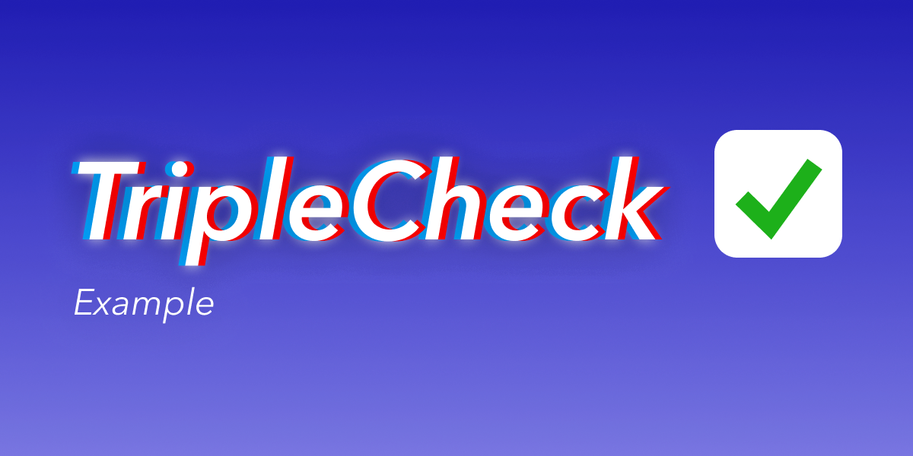

# triplecheck-example-lambda

## TripleCheck broker running on AWS Lambda and DynamoDB

This repo demonstrates a working, basic implementation of a [TripleCheck broker](https://github.com/mikaelvesavuori/triplecheck-broker) running on AWS Lambda with the database in DynamoDB (pay-as-you-go model).

Refer to the documentation on the [broker](https://github.com/mikaelvesavuori/triplecheck-broker) for how to call the API.

Technology choices are:

- [Node.js](https://nodejs.org/en/)
- [TypeScript](https://www.typescriptlang.org)
- [Serverless Framework](https://www.serverless.com) for easing deployment and packaging
- [Webpack](https://webpack.js.org) for bundling

## Pre-requisites

- An AWS account
- AWS credentials in your environment so that Serverless Framework can pick them up
- Sufficient credentials to deploy and remove Lambda, API Gateway, S3 and DynamoDB
- Configure the `custom` block in `serverless.yml` so it uses your own values

## Installation

Run `npm install` or `yarn install`.

## Local development

Run `npm start` or `yarn start`.

## Deploy

Run `npm run deploy` or `yarn run deploy`.

## Teardown (remove stack)

Run `npm run remove` or `yarn run remove`.
